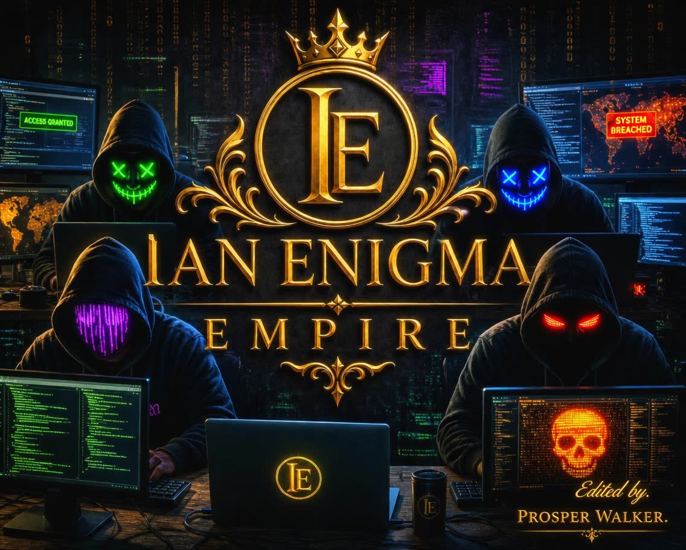

<div align="center">



<a href="#">
  
</a>

<br/><br/>


<br/>


<br/><br/>

> **"One Command. Endless Power."**
>
> 🦇 Designed & Built by **IANENIGMA** — Uganda 🇺🇬

</div>

---

## 🦇 What is IANENIGMA MD?

**IANENIGMA MD** is a feature-rich WhatsApp Multi-Device bot built on the Baileys v7 library, blending **DC and Marvel character theming** with serious functionality: **315+ commands**, **24 switchable superhero themes**, a **bio-rotation anti-ban system**, built-in **AI tools**, **auto-translate**, and full group moderation — all wrapped in a personality that never feels robotic.

Built from the ground up for performance, personality, and protection.

---

## ✨ What Makes It Different

| Feature | Description |
|---|---|
| 🎨 **24 Hero Themes** | 12 DC + 12 Marvel themes — each changes the bot's banner, dividers, quotes, and personality |
| 🌐 **Auto-Translate** | Detects any language sent in a chat and replies with the English translation automatically — togglable per chat or globally |
| 🛡️ **Antiban Bio Rotation** | Rotates the bot's WhatsApp bio through 233 unique quotes on a timer, mimicking real human account activity |
| 🤖 **AI Toolkit** | ChatGPT, Gemini, free no-key AI chat, AI image generation, AI summarization, AI roast/compliment |
| 🎵 **Music & Media** | YouTube MP3/MP4, Spotify search, mood-based AI music, Top 10 charts, Netflix release tracker |
| 🎮 **Mini-Games** | Wordle, trivia quiz with leaderboard, hangman, tic-tac-toe, RPS, daily lottery |
| 👮 **Full Moderation Suite** | Antilink, antiflood, antiraid, slowmode, lockwords, mod logs, warning system with auto-kick |
| ⏰ **Uganda Time Aware** | Sleep mode, greetings, and scheduling all run on EAT (UTC+3) |
| 🔑 **Dynamic Prefix** | `.setprefix` changes the command prefix instantly — no restart needed |
| 📦 **Custom Repo Display** | `.setrepo` lets the owner link their own GitHub with live stars/forks |

---

## 🎨 Themes — DC Universe & Marvel

Switch the bot's entire personality with one command. **24 themes** across two universes:

### 🦇 DC Universe (12 themes)
```
.theme batman        .theme superman       .theme joker
.theme wonderwoman    .theme flash          .theme greenlantern
.theme aquaman        .theme harleyquinn    .theme arrow
.theme shazam         .theme peacemaker     .theme vigilante
```

### 🕷️ Marvel Universe (12 themes)
```
.theme ironman        .theme spiderman      .theme blackpanther
.theme thor           .theme captainamerica .theme blackwidow
.theme hulk           .theme doctorstrange  .theme antman
.theme scarletwitch    .theme wolverine      .theme deadpool
```

Each theme has its own: **banner • border style • bullet points • quote • greeting personality • error/success messages**

Run `.theme list` to see all options live from the bot.

---

## 🌐 Auto-Translate

The bot can automatically detect any non-English message sent in a chat and reply with the English translation — no command needed once enabled.

```
.autotranslate on          — Enable for this chat (admin only in groups)
.autotranslate off         — Disable for this chat
.autotranslate              — Check current status
.autotranslate global on   — Enable across ALL chats (owner only)
.autotranslate global off  — Disable globally (owner only)
```

Runs on a 3-API fallback chain (Google Translate → MyMemory → LibreTranslate) — no API key required, and silently skips messages already in English.

---

## 🛡️ Anti-Ban Protection System

| Protection | How it helps |
|---|---|
| **Bio Rotation** | Rotates the bot's status through 233 unique quotes on a timer — mimics human behavior |
| **Sleep Mode** | Goes quiet 1AM–6AM Uganda time — bots don't normally sleep, this one does |
| **Typing Simulation** | Shows a composing indicator before replies for human-like timing |
| **Anti-Flood** | Rate-limits fast senders per group to avoid bulk-messaging flags |
| **Anti-Raid** | Auto-locks the group on mass joins to stop raid-triggered detection |
| **Broadcast Filter** | Ignores broadcast and heavily-forwarded messages |
| **Unsaved Number Block** | Silently ignores DMs from unsaved numbers to dodge spam traps |
| **View-Once Stealth** | Handles view-once media privately, no public re-sharing |
| **Anti-Link / Anti-Badword** | Strips spam links and flagged words from group chats |

Check live status anytime with `.antiban status` or `.banprotection`.

---

## 📋 Command Categories (315+)

| Category | Examples |
|---|---|
| ⚡ General | `.help` `.ping` `.alive` `.botinfo` `.changelog` |
| 🌍 Location & Info | `.weather` `.news` `.setlocation` `.localtime` |
| 🌐 Translate | `.translate` `.trt` `.autotranslate` |
| 🤖 AI & Smart | `.gpt` `.gemini` `.ask` `.imagine` `.summarize` `.chatbot` |
| 🎵 Music & Media | `.play` `.ytmp3` `.ytmp4` `.spotify` `.aimusic` `.netflix` |
| 📥 Downloaders | `.instagram` `.tiktok` `.facebook` `.compress` `.pdf` |
| 🎨 Media & Stickers | `.sticker` `.removebg` `.remini` `.attp` `.tts` `.ss` |
| 🎮 Games | `.wordle` `.quiz` `.hangman` `.tictactoe` `.rps` `.lottery` |
| 🃏 Fun & Social | `.joke` `.flirt` `.ship` `.wasted` `.afk` `.remind` |
| 👤 User Features | `.profile` `.rep` `.marry` `.inventory` `.birthday` `.qr` |
| 👮 Admin | `.ban` `.promote` `.kick` `.warn` `.tagall` `.inactive` |
| 🏰 Group Management | `.rules` `.welcome` `.autoreply` `.poll` `.schedule` |
| 🛡️ Moderation | `.antilink` `.antiflood` `.antiraid` `.slowmode` `.lockwords` |
| 📅 Automation | `.daily` `.autotyping` `.autoread` `.antidelete` `.autokick` |
| 🔒 Owner Only | `.mode` `.setprefix` `.setpp` `.setbio` `.sudo` `.backup` |
| 🛡️ Antiban | `.antiban` `.banprotection` |
| 🎨 Themes | `.theme <name>` `.theme list` |

Run `.menu search <keyword>` inside the bot to find any command instantly.

---

## 🚀 Setup

### Requirements
- Node.js ≥ 18.0.0
- npm ≥ 9.0.0

### Installation

```bash
git clone https://github.com/ianenigma4-rgb/Ianenigma-official-bot.git
cd Ianenigma-official-bot
npm install
```

### Pairing

Get your session ID from the pairing site, then set it as an environment variable before starting:

```bash
SESSION_ID=ADEVOS-X:~your_base64_creds_here
```

The bot also accepts session IDs in the `BlackHat~` format and plain base64 — every common format from the major pairing sites decodes automatically, no configuration needed.

**Supported session ID formats:**

| Format | Example |
|---|---|
| ADEVOS-X | `ADEVOS-X:~eyJjcmVkcyI6...` |
| Semicolon-prefixed | `IANENIGMA;;;eyJjcmVkcyI6...` |
| BlackHat | `BlackHat~6ThJaGa4qfm6eyJjcmVkcyI6...` |
| Plain base64 | `eyJjcmVkcyI6...` |

Whatever site generated your session ID, paste the whole string as-is into `SESSION_ID` — the bot strips the prefix and decodes the credentials automatically.

For multi-session setups, use `SESSION1_ID` through `SESSION5_ID`.

| Tool | URL |
|---|---|
| Pairing / Session ID generator | `https://adevos-x-pair.onrender.com` |
| Alternate pairing site | `ianenigma-pair.onrender.com` |

### Running

```bash
npm start                  # standard start
npm run start:optimized    # memory-optimized start
npm run start:clean        # cleanup + optimized start
npm run start:fresh        # reset session + start
```

---

## ☁️ Deployment

The bot runs on **Render**, **Replit**, **Railway**, and **Termux** (self-hosted on Android). A `Procfile` and `app.json` are included for Heroku-style platforms. Choose the platform that fits your setup below.

---

### 🟢 Render (Recommended — Free Tier Available)

Render keeps your bot online 24/7 with a free web service. The `Procfile` is already included.

1. Go to [render.com](https://render.com) and sign in with GitHub
2. Click **New → Web Service**
3. Connect this repo: `ianenigma4-rgb/Ianenigma-official-bot`
4. Set the following in the Render dashboard:

   | Setting | Value |
   |---|---|
   | **Environment** | `Node` |
   | **Build Command** | `npm install --legacy-peer-deps` |
   | **Start Command** | `npm start` |
   | **Plan** | Free (or Starter for always-on) |

5. Under **Environment Variables**, add:

   ```
   SESSION_ID     = your_session_id_here
   OWNER_NUMBER   = 256XXXXXXXXX
   BOT_NAME       = IANENIGMA MD BOT
   ```

6. Click **Deploy** — Render will build and start the bot automatically
7. Check the **Logs** tab to confirm the bot connects to WhatsApp

> ⚠️ Free Render services spin down after 15 minutes of inactivity. Use the **Starter plan** ($7/mo) or a keep-alive ping service to stay online 24/7.

---

### 🔵 Replit (Easy Setup, Always-On with Hacker Plan)

1. Go to [replit.com](https://replit.com) and create a new **Node.js** Repl
2. In the Shell tab, run:
   ```bash
   git clone https://github.com/ianenigma4-rgb/Ianenigma-official-bot.git .
   npm install --legacy-peer-deps
   ```
3. Open the **Secrets** tab (🔒 icon) and add:
   ```
   SESSION_ID     = your_session_id_here
   OWNER_NUMBER   = 256XXXXXXXXX
   BOT_NAME       = IANENIGMA MD BOT
   ```
4. In `.replit`, set the run command:
   ```
   run = "npm start"
   ```
5. Click **Run** — the bot will start and connect to WhatsApp
6. To keep it online 24/7, enable **Always On** (requires Hacker plan) or use [UptimeRobot](https://uptimerobot.com) to ping the Repl URL every 5 minutes

---

### 🚂 Railway (One-Click Deploy, $5 Free Credits)

1. Go to [railway.app](https://railway.app) and sign in with GitHub
2. Click **New Project → Deploy from GitHub repo**
3. Select `ianenigma4-rgb/Ianenigma-official-bot`
4. Railway auto-detects Node.js and uses the `Procfile` — no extra config needed
5. Go to **Variables** and add:
   ```
   SESSION_ID     = your_session_id_here
   OWNER_NUMBER   = 256XXXXXXXXX
   BOT_NAME       = IANENIGMA MD BOT
   NODE_OPTIONS   = --max-old-space-size=460
   ```
6. Click **Deploy** — Railway builds and starts the bot
7. Check **Logs** to confirm WhatsApp connection

> Railway gives $5 free credits monthly — enough to run the bot ~500 hours/month on the smallest instance.

---

### 📱 Termux (Self-Hosted on Android — No Server Needed)

Run the bot directly on your Android phone — no cloud required.

1. Install **Termux** from [F-Droid](https://f-droid.org/packages/com.termux/) (not Play Store)
2. Open Termux and run:
   ```bash
   pkg update && pkg upgrade -y
   pkg install nodejs git -y
   ```
3. Clone the repo:
   ```bash
   git clone https://github.com/ianenigma4-rgb/Ianenigma-official-bot.git
   cd Ianenigma-official-bot
   npm install --legacy-peer-deps
   ```
4. Create a `.env` file with your credentials:
   ```bash
   nano .env
   ```
   Add these lines:
   ```
   SESSION_ID=your_session_id_here
   OWNER_NUMBER=256XXXXXXXXX
   BOT_NAME=IANENIGMA MD BOT
   ```
   Save with `Ctrl+X → Y → Enter`
5. Start the bot:
   ```bash
   npm start
   ```
6. To keep it running when Termux is in the background, install **Termux:Boot** from F-Droid and add a startup script, or run inside a `screen` session:
   ```bash
   pkg install screen -y
   screen -S ianenigma
   npm start
   # Detach with Ctrl+A then D
   # Re-attach later with: screen -r ianenigma
   ```

> ⚠️ Keep your phone plugged in and disable battery optimization for Termux to avoid the bot disconnecting.

---

### ⚙️ Environment Variables Reference

These variables are supported across all platforms:

| Variable | Required | Description |
|---|---|---|
| `SESSION_ID` | ✅ Yes | Your WhatsApp session ID from the pairing site |
| `SESSION1_ID` – `SESSION5_ID` | Optional | Additional sessions for multi-bot setups |
| `OWNER_NUMBER` | ✅ Yes | Your WhatsApp number (no `+`, e.g. `256700000000`) |
| `BOT_NAME` | Optional | Display name for the bot (default: `IANENIGMA MD BOT`) |
| `PREFIX` | Optional | Command prefix (default: `.`) — can also be changed live with `.setprefix` |
| `NODE_OPTIONS` | Optional | Set to `--max-old-space-size=460` on low-memory platforms |
| `PORT` | Optional | HTTP port for the pairing web UI (default: `3000`) |

---

## ⚙️ Configuration

Edit `settings.js` to set your bot identity:

```js
botName: "IANENIGMA MD BOT",
botOwner: "IANENIGMA",
ownerNumber: "256XXXXXXXXX",   // your number, no + symbol
commandMode: "public",          // or "private"
```

Most other settings (prefix, theme, antiban interval, auto-translate scope) can be changed live from WhatsApp using owner-only commands — no redeploy needed.

---

## 🤝 Contributors

<div align="center">


</div>

### 🦇 IANENIGMA — Creator & Lead Developer
The architect behind the entire IANENIGMA MD ecosystem — concept, code, and brand.


**Contributions:**
- 🏗️ Built the core bot from scratch on Baileys v7 (Multi-Device WhatsApp Web API)
- 🎨 Designed and implemented all 24 DC & Marvel character themes
- 🤖 Developed the full 315+ command library across AI, games, moderation, and media
- 🛡️ Engineered the antiban bio-rotation system (233 rotating quotes)
- 🌐 Built the auto-translate feature with 3-API fallback chain
- 📅 Implemented automation systems — daily scheduler, auto-kick, antiraid, antiflood
- 🔁 Replaced dead/rate-limited third-party APIs with working alternatives
- 🖥️ Built and maintained the Termux self-hosting platform for personal deployment
- 🧩 Designed the multi-session bot manager (`SESSION1_ID`–`SESSION5_ID`)
- 📦 Maintains the GitHub repository and ongoing version releases

---

### 🔗 ADEVOS — Pairing Infrastructure
Built and maintains the session pairing site that powers bot authentication.


**Contributions:**
- 🔑 Built `adevos-x-pair.onrender.com` — the session ID generator/pairing site used to link WhatsApp accounts to the bot
- 📡 Designed the `ADEVOS-X:~` session ID format (base64-encoded Baileys credentials)
- ⚙️ Provides the pairing backend that powers `SESSION_ID` and multi-session generation

---

> Want to contribute? Open a pull request on the [bot repository](https://github.com/ianenigma4-rgb/Ianenigma-official-bot) or reach out via the WhatsApp channel below.

---

## 📢 Links

<div align="center">

[](https://github.com/ianenigma4-rgb/Ianenigma-official-bot)
[](https://whatsapp.com/channel/0029VbCiP1Y1noywqpmoSz2z)
[](https://adevos-x-pair.onrender.com)

</div>

- **Bot Repository:** `https://github.com/ianenigma4-rgb/Ianenigma-official-bot`
- **WhatsApp Channel:** `https://whatsapp.com/channel/0029VbCiP1Y1noywqpmoSz2z`
- **Pairing Site (by ADEVOS):** `https://adevos-x-pair.onrender.com`

---

<div align="center">

🦇 **IANENIGMA EMPIRE** 🦇

_"In the shadows of code, a legend was built."_

</div>
